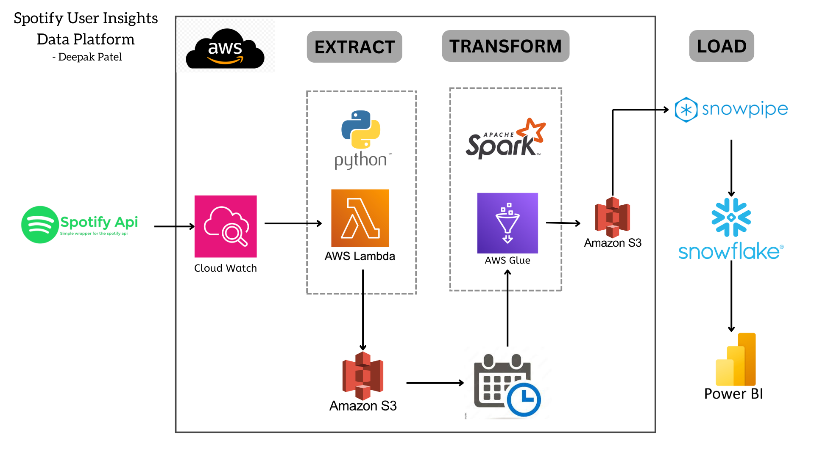

# Spotify User Insights Data Platform

This repository contains the implementation of a data engineering project aimed at building a scalable and efficient data pipeline to extract, transform, and load (ETL) Spotify user data, and generate actionable insights through Power BI dashboards.

---

## Architecture Diagram

The architecture diagram illustrates the workflow of the ETL process, which utilizes AWS services and integrates with Power BI for visualization.

---

## Project Workflow

1. **Extract:**
   - Data is sourced from the Spotify API and monitored using AWS CloudWatch.
   - AWS Lambda is used to trigger data ingestion tasks.

2. **Transform:**
   - Raw data is stored in Amazon S3.
   - AWS Glue and PySpark process and transform the data.

3. **Load:**
   - Processed data is loaded into Snowflake using Snowpipe.
   - Snowflake serves as the data warehouse for analytics.

4. **Visualization:**
   - Power BI connects to Snowflake to create interactive dashboards and generate actionable insights.

---

## Key Features

- **Scalable Architecture:** Designed to handle large datasets with AWS Glue and Snowflake.
- **Data Processing:** Leveraged PySpark for efficient data transformation.
- **Visualization:** Built Power BI dashboards to analyze user engagement and listening habits.

---

## Project Highlights

- Extracted and transformed **500,000+ Spotify user records** using Python, SQL, and AWS Glue.
- Processed **~50MB of data** efficiently with AWS S3 and PySpark.
- Built Power BI dashboards, providing actionable insights into user engagement and listening habits.

---

## Tech Stack

- **Programming Languages:** Python, SQL
- **Cloud Services:** AWS (S3, Lambda, Glue, CloudWatch), Snowflake
- **Data Processing Framework:** Apache Spark (PySpark)
- **Visualization Tool:** Power BI

---

## Future Enhancements

- Implement real-time data streaming using Apache Kafka.
- Enhance the dashboards with predictive analytics capabilities.

